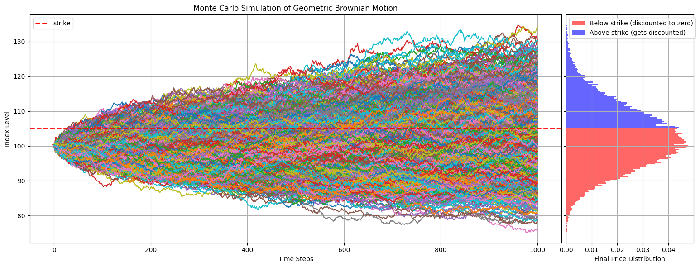

# Monte Carlo Option pricing implementation

This repository conataisn a simple implemenation of the Monte Carlo option pricing for europian call options. Monte Carlo option pricing involves generating multiple random paths of prices for the underlying asset, staring from the current price $S_0$, and following the below stochastic process with a finite-time step size $\Delta t$ until the maturity date of the option. And averaging over the **discounted** final prices $S_T$ at present time.

$$
S_t=S_{t-1} e^{\left(r-\frac{\sigma^2}{2}\right) \Delta t+\sigma \varepsilon_t \sqrt{\Delta t}}
$$

where
$$
    \begin{gathered}
    S_0: \text { initial equity price } \\
    r:\text {risk free rate}\\
    \sigma: \text { underlying asset volatility } \\
    \Delta t: \text { time step }
    \end{gathered}
$$

You can simply run the code via
```
> python main.py
```

## Results

Example MC pricing for an 6-month option on an asset at $100 with a strike price of $105 is shown below:




## TODO

- Add Greeks calculation
- Implement variance reduction techniques
- Add analytical Black-Scholes for comparison
- Include error analysis
- Support more option types
- proper documentation and type hints
- OOP interface